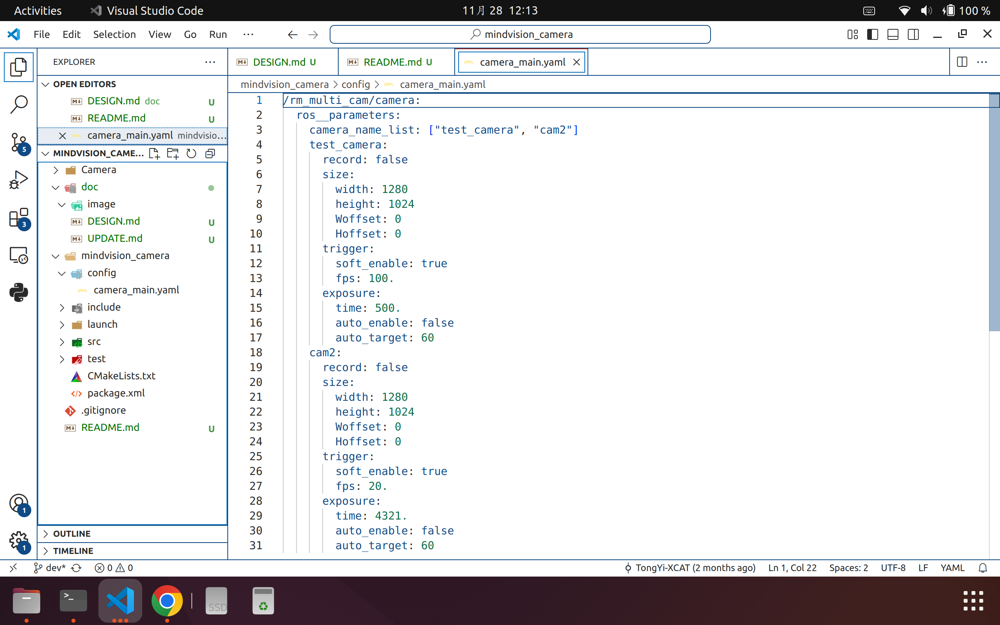

# 相机节点（迈德威视）

维护负责人：徐叶茂

## 使用方法

1. 得到你现在所用的相机的昵称
    - 你可以用迈德威视的上位机程序去给它取一个，或者用一个[简单的程序](https://github.com/TongYi-XCAT/mindvision_camera_nickname_config)
2. 得到一个迈德威视的配置文件，并按照`<相机昵称>-Group1.config`的格式为它命名，将其放在`<你的工作区>/Camera/Configs/`目录下
    - 配置文件你可以用迈德威视的上位机程序单独为每个相机生成，也可以复制祖传的
3. 根据你的相机昵称配置ROS2节点的参数配置文件
    - 首先是把你的相机昵称加进`camera_name_list`这个字符串列表参数里
    - 按照格式配置（现在能运行时配置的是`<相机昵称>.record`、`<相机昵称>.exposure.time`和`<相机昵称>.trigger.fps`）

## 功能列表

1. 视频录制功能
2. ~~中间数据录制功能，录ros包~~改由调试模块里的组件负责
3. ~~支持多相机不掉帧~~这个实际上是用户要用多线程执行器，和模块程序无关
4. 运行时调整参数
5. 软触发取图（软件定帧率）
6. （未补充）纯连续取图不定帧率
